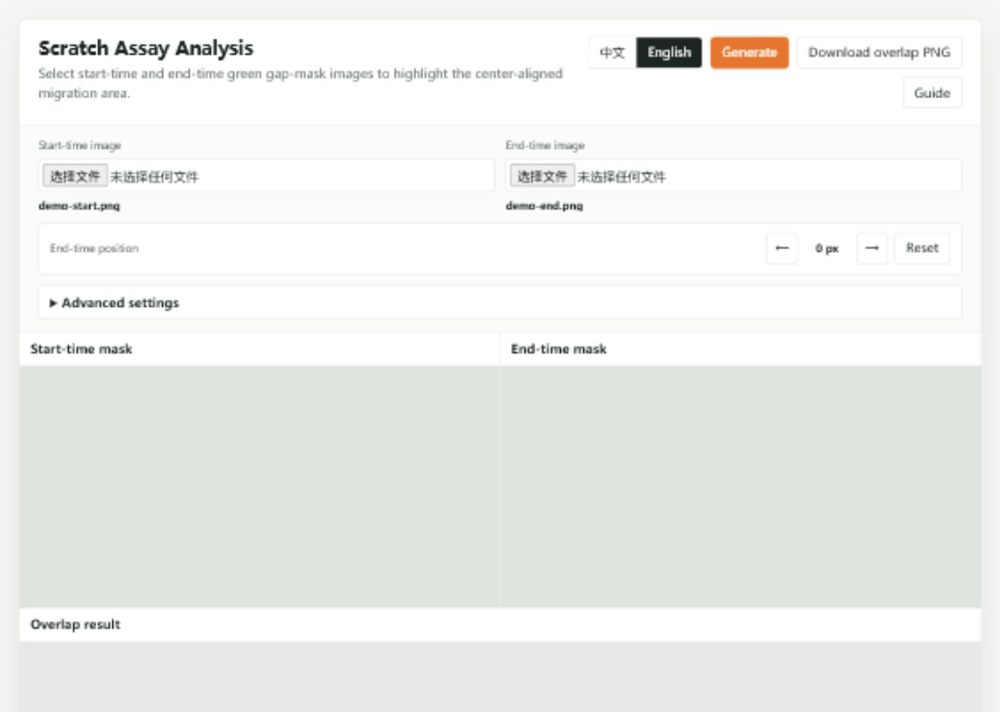
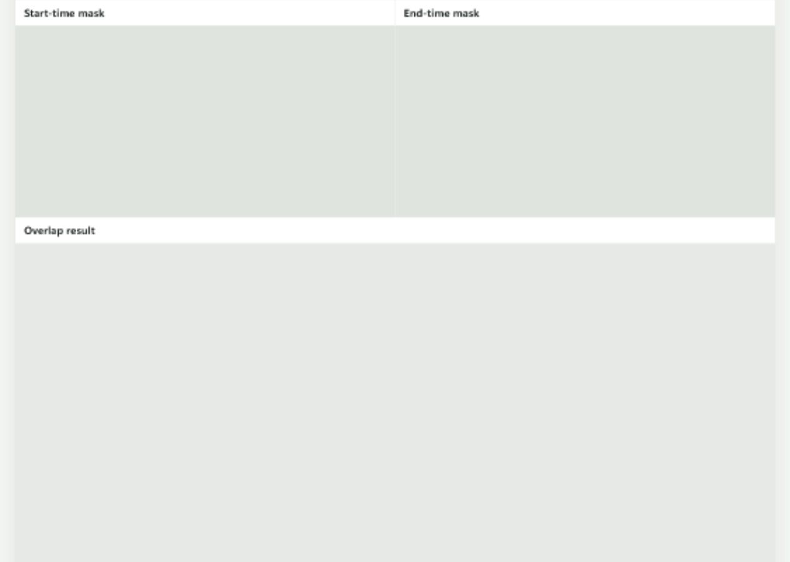

# Scratch Assay Visualizer

配合 SWEET 使用的划痕实验面积变化可视化工具。

先用 SWEET 处理原始显微图，导出绿色 gap 蒙版；再把开始时间和结束时间两张绿色蒙版导入本网页，即可生成面积变化图。

在线使用：

[https://baijinming97.github.io/scratch-assay-visualizer/](https://baijinming97.github.io/scratch-assay-visualizer/)

## 适合做什么

- 比较不同处理组的划痕迁移差异
- 把开始时间和结束时间的 gap 变化直接画出来
- 把结果图下载为 PNG，放入实验记录、汇报 PPT 或论文草图

## Workflow

```text
SWEET 识别划痕 gap
        ↓
导出绿色 gap 蒙版
        ↓
导入 Start-time image 和 End-time image
        ↓
生成 overlap 面积变化图
        ↓
下载 overlap PNG
```

## Step 1. 在 SWEET 中导出绿色蒙版

在 SWEET 中完成划痕区域识别后，保存带绿色 gap mask 的图片。每个视野需要两张图：

- `Start-time image`：开始时间的绿色 gap 蒙版
- `End-time image`：结束时间的绿色 gap 蒙版

建议两张图来自同一视野、同一倍率、同一裁剪范围。推荐导出为 PNG、JPG 或 WebP。如果显微镜软件导出的是 TIF，请先另存为 PNG。

## Step 2. 导入两张图片

打开网页后，分别选择开始时间和结束时间图片。选择完成后，`Generate` 按钮会变成可点击状态。



## Step 3. 生成 overlap 面积变化图

点击 `Generate`。网页会自动：

- 提取两张图中的绿色 gap mask
- 将开始时间和结束时间的 gap 居中对齐
- 计算 `开始时间 gap - 结束时间 gap`
- 在下方生成 overlap 结果图



## 结果怎么看

- 上方左图：`Start-time mask`，用于检查开始时间绿色蒙版
- 上方右图：`End-time mask`，用于检查结束时间绿色蒙版
- 下方大图：`Overlap result`，是真正要下载和汇报的结果图
- 橙色区域：开始时间 gap 中已经减少的部分，也就是迁移面积变化
- 绿色线：结束时间剩余 gap 的边界
- `Migration ratio`：橙色面积占开始时间 gap 的比例，可用于比较不同处理组

## 左右微调什么时候用

大多数情况下不用调。

如果 overlap 图里橙色几乎只在一侧，而你确认实际实验中两侧都有迁移，可以使用 `End-time position` 的左右箭头微调。每点一次移动 `2 px`，网页会自动重新生成结果。

微调的目标不是让左右面积完全相等，而是让绿色边界和结束时间图里的 gap 边缘更合理。如果怎么调都不合理，通常说明两张图不是同一视野，或 SWEET 输出的绿色蒙版需要重新检查。

## 下载结果

点击 `Download overlap PNG`。下载内容只包含下方的 overlap 结果图，不包含上方两个 mask 检查图。

## 常见问题

### 可以直接导入原始显微图吗？

不建议。本工具假设输入已经是 SWEET 等软件处理后的绿色 gap 蒙版。

### 为什么提示没有检测到绿色 mask？

请检查 SWEET 导出的 gap 是否是明显绿色。如果绿色很浅，可以展开 `Advanced settings`，稍微降低 `Green threshold`。

### 为什么 start 和 end 尺寸不一致？

两张图必须使用同一倍率和同一裁剪范围。如果一张图被裁掉或缩放过，建议回到 SWEET 或显微镜软件重新导出。

### 统计时应该记录什么？

建议记录 `Migration ratio`，并且所有处理组都使用相同的 SWEET 设置和相同的本工具参数。
